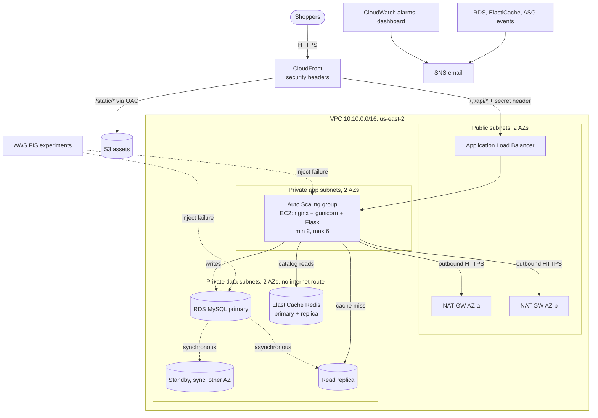

# Architecture: High-Availability E-commerce Platform

## 1. The problem

The company's storefront goes down during peak traffic. That costs revenue and frustrates customers. The brief asks for an architecture that stays available through traffic spikes and component failures, and that recovers without people stepping in.

## 2. Analysis of the existing architecture

The brief describes the current system by its symptoms: frequent downtime, no fault tolerance, inefficient use of resources and manual recovery. Those symptoms match a typical single-server deployment. The table maps each symptom to its likely cause and to how this design fixes it.

| Current limitation | Likely root cause | Impact | How this design fixes it |
|---|---|---|---|
| Frequent downtime at peak | Fixed capacity: one or a few manually sized servers | Requests time out, sales are lost | Auto Scaling on CPU and on requests per target, plus an optional pre-scale schedule for known peaks |
| No fault tolerance | Web server and database in one AZ (or on one host) | Losing one instance, disk or AZ takes the whole store down | Every tier runs in two AZs: ALB, ASG, RDS Multi-AZ, Redis Multi-AZ, NAT per AZ |
| Database is the bottleneck | Every page view queries the primary | Slow pages and connection exhaustion under load | Redis cache in front of a read replica. The primary only handles writes |
| Manual recovery | Nobody is paged and nothing self-heals | Long outages, especially outside office hours | ELB health checks replace instances, RDS and Redis fail over automatically, and alarms and events go to SNS |
| Slow for distant users, origin overloaded | All static content served from the origin | High latency and wasted origin capacity | CloudFront caches static files (S3) and briefly caches catalog reads at the edge |
| Poor visibility | No central metrics or audit trail | Problems found by customers first | CloudWatch dashboard, 18 alarms, VPC flow logs, ALB access logs, CloudTrail |

## 3. Target architecture

A polished version of this diagram is in Lucid (diagram by Adenusi). Export it to `docs/architecture.png` and link it here.

### Request flow

1. The browser connects to **CloudFront** over HTTPS. `/static/*` is served from the private **S3** bucket through Origin Access Control and cached for a day.
2. `/api/products` is cached at the edge for 30 seconds. Everything else (pages, cart, orders) goes to the **ALB** uncached.
3. CloudFront adds a secret `X-Origin-Verify` header. The ALB forwards only requests that carry it, and its security group admits only CloudFront's origin-facing IP ranges, so nobody can go around the CDN.
4. The ALB spreads requests across healthy instances in both AZs (cross-zone load balancing enabled).
5. An instance reads the catalog from **Redis**. On a miss it reads from the **read replica**, falling back to the **primary** if the replica is unavailable, then fills the cache for 60 seconds.
6. Orders are written to the **primary** in a single transaction (`SELECT ... FOR UPDATE`, stock decrement, insert), and the cached catalog is invalidated.

## 4. How each failure is handled

| Failure | Detection | Automatic recovery | Expected customer impact |
|---|---|---|---|
| One web instance crashes or hangs | ALB health check on `/health` (15 s interval, 3 failures) | ALB stops routing to it; the ASG (ELB health check type) replaces it | None; in-flight requests on that instance may fail |
| A whole AZ is lost (web tier) | ALB health checks; `UnHealthyHostCount` alarm | Traffic shifts to the surviving AZ; the ASG launches replacements and rebalances | A short spike in latency while the surviving capacity absorbs the load |
| Traffic spike | CPU and `RequestCountPerTarget` metrics | Target tracking scales out to 6 instances, then back in | Minimal once new instances warm up (about 3 minutes) |
| Primary database failure | RDS Multi-AZ monitoring | The standby is promoted and the writer DNS name moves to it | Writes fail for about 60 to 120 s; reads keep working from Redis and the replica |
| Read replica failure | `ReplicaLag` alarm, RDS events | The app falls back to reading from the primary | None |
| Redis primary failure | ElastiCache monitoring | A replica is promoted and the primary endpoint DNS moves to it | Catalog reads fall back to the database for a few seconds |
| NAT gateway or AZ network loss | Route table per AZ | Each AZ has its own NAT, so the other AZ is unaffected | None for the surviving AZ |
| Whole origin down | CloudFront 5xx | CloudFront serves a maintenance page from S3 | A friendly message instead of a raw error |

The ALB health check (`/health`) deliberately does **not** check the database or cache. If it did, a database failover would mark every instance unhealthy at the same moment, and the ASG would tear down a healthy web tier. Dependency health is reported separately at `/health/deep`.

## 5. Key design decisions

| Decision | Reason | Trade-off |
|---|---|---|
| Two AZs (three optional through `az_count`) | Meets the HA requirement at the lowest cost | Losing one AZ halves capacity until the ASG catches up |
| One NAT gateway per AZ | Removes a cross-AZ single point of failure for outbound traffic | About $33 per month per extra NAT; `single_nat_gateway` exists for cheap test runs |
| RDS Multi-AZ **and** a read replica | Multi-AZ gives automatic failover for writes, and the replica offloads reads. They solve different problems | A replica is asynchronous, so reads can be slightly stale (the order list reads from the primary on purpose) |
| RDS managed master password | No password in Terraform state or in code; rotated by AWS | The app refreshes credentials on an authentication failure |
| TLS everywhere inside the VPC | `require_secure_transport` on MySQL and TLS on Redis, so data in transit is encrypted even on private links | Small CPU overhead |
| Customer managed KMS key | One auditable key for RDS, Redis, Secrets Manager, logs and SNS, with rotation | $1 per month per key |
| Private instances with Session Manager | No SSH keys, no bastion, no port 22; every session is logged | Requires the Session Manager plugin on the laptop |
| CloudFront in front of the ALB | Global edge TLS, static offload, short catalog caching and a maintenance page | Needs the origin lock (prefix list plus secret header) to stop bypass |
| Instance refresh on every launch template change | New AMIs and app versions roll out with at least 50% capacity kept healthy | A deploy takes several minutes |
| AWS FIS for failure testing | Repeatable, audited failure injection instead of clicking in the console | Small per-action-minute charge while an experiment runs |

## 6. Security controls

- Network isolation: three subnet tiers. The data tier has no route to the internet, and the default security group is stripped of all rules.
- Least privilege security groups: CloudFront to the ALB, the ALB to the app on port 80, the app to MySQL on 3306 and to Redis on 6379. Egress is explicit.
- IAM: the instance role can read only its own app bundle and its two secrets, and can decrypt only through Secrets Manager.
- Encryption at rest: RDS, Redis, Secrets Manager, CloudWatch Logs and SNS use the stack KMS key. EBS and S3 are also encrypted.
- Audit: a multi-region CloudTrail with log file validation, VPC flow logs and ALB access logs.
- Edge: HTTPS enforced, and AWS managed security headers (HSTS, X-Frame-Options, and others).

## 7. Cost estimate (us-east-2, on-demand, running continuously)

| Component | Approx. monthly |
|---|---|
| NAT gateways (2) | $66 |
| Public IPv4 addresses (NAT and ALB) | $15 |
| Application Load Balancer | $21 |
| EC2 web tier (2 x t3.micro, EBS, detailed monitoring) | $23 |
| RDS MySQL Multi-AZ db.t3.micro plus a read replica | $44 |
| ElastiCache Redis (2 x cache.t3.micro) | $25 |
| KMS, Secrets Manager, CloudWatch alarms and dashboard, logs | $8 |
| CloudFront, S3, CloudTrail (light test traffic) | $2 |
| **Total** | **about $204 per month (about $0.28 per hour)** |

A typical 6 hour build and test session costs about $2 to $3. Run `infracost breakdown --path .` for a current figure, and always `terraform destroy` when testing is done.

## 8. What production would add

- A custom domain with ACM certificates for end-to-end TLS (the variables already exist) and Route 53 alias records
- AWS WAF on CloudFront with the managed rule groups and rate limiting
- Aurora MySQL for faster failover (typically under 30 seconds) and up to 15 replicas
- RDS Proxy to pool connections and shorten failover impact on the app
- A CI/CD pipeline that builds a golden AMI and triggers the instance refresh
- Interface VPC endpoints for SSM, Secrets Manager and CloudWatch to remove the NAT dependency for AWS APIs
